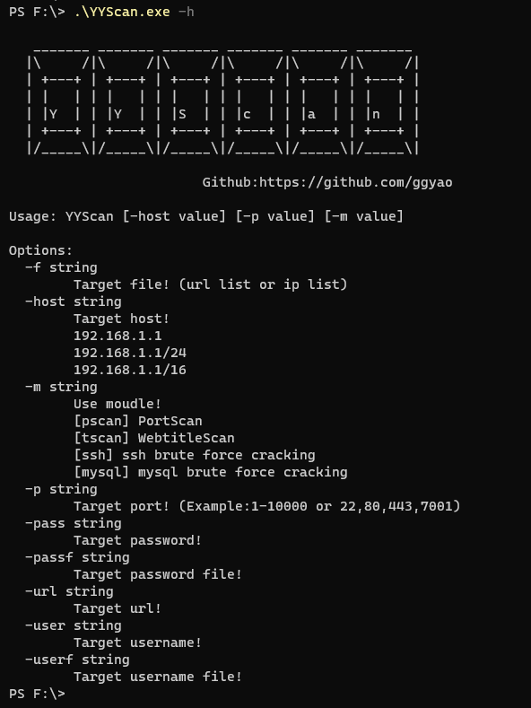
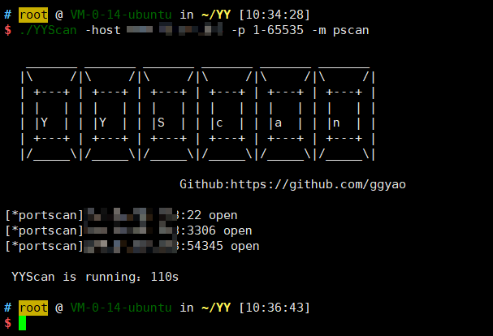
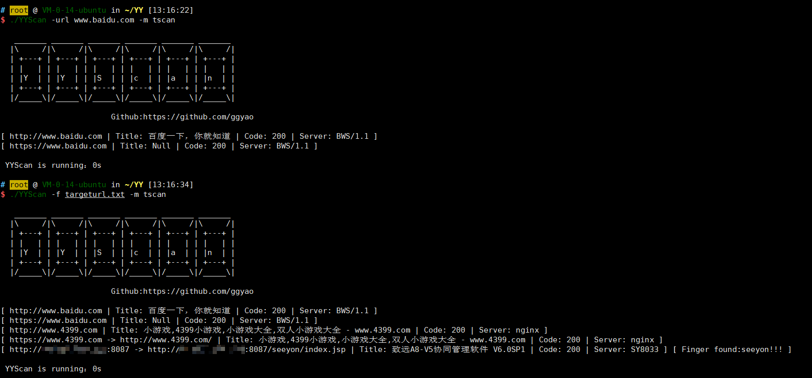
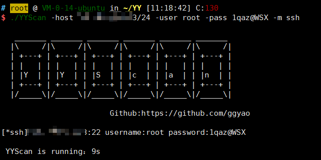
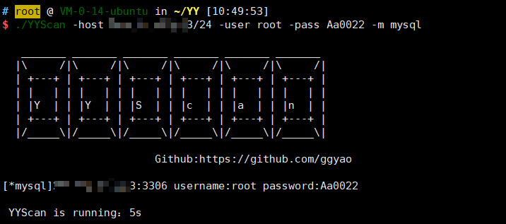

# YYScan

## 0x01 简介

​       YYScan是一款Golang编写的模块化工具，速度很奈斯，主要功能有端口扫描、网站title识别、网站指纹识别、ssh暴力破解、mysql暴力破解。

## 0x02 模块介绍

#### [pscan]

portscan模块，扫描端口。

examples：

./YYScan -host 1.1.1.1 -p 1-65535 -m pscan

./YYScan -host 1.1.1.1 -p 80,3306,1433...... -m pscan

./YYScan -host 1.1.1.1/24 or /16 -p 80,3306,1433...... -m pscan

./YYScan -f .\ips.txt -p 22,3306,1433...... -m pscan（指定一个ip列表扫描端口。）

#### [tscan]

WebtitleScan模块，扫描网站title，遇到30x跳转网站会有识别；进行指纹识别，这里用了Ehole的指纹，感谢~

examples：

./YYscan -url www.baidu.com -m tscan（有做处理，带不带http://都可。）

./YYscan -f targeturl.txt -m tscan（指定一个url地址列表，对其进行title、指纹识别。）

./YYscan -host 1.1.1.1/24 or /16 -p 80,8080,8443 -m tscan

./YYscan -host 1.1.1.1 -p 1-65535 -m tscan

#### [ssh]

ssh模块，ssh暴力破解模块。默认22端口，可使用-p选项自定义端口。（对目标ip列表做的协程，目标指定为网段食用效果最佳。）

examples：

./YYscan -host 1.1.1.1 -user root -pass 123456 -m ssh -p 22

./YYscan -host 1.1.1.1/24 or /16 -userf user.txt -passf pass.txt -m ssh

#### [mysql]

mysql模块，mysql暴力破解模块。（对目标ip列表做的协程，目标指定为网段食用效果最佳。）

examples：

./YYscan -host 1.1.1.1 -user root -pass 123456 -m mysql -p 3306

./YYscan -host 1.1.1.1/24 or /16 -userf user.txt -passf pass.txt -m mysql

## 0x03 To Do

1、后面会根据需求添加一些实用小功能。

